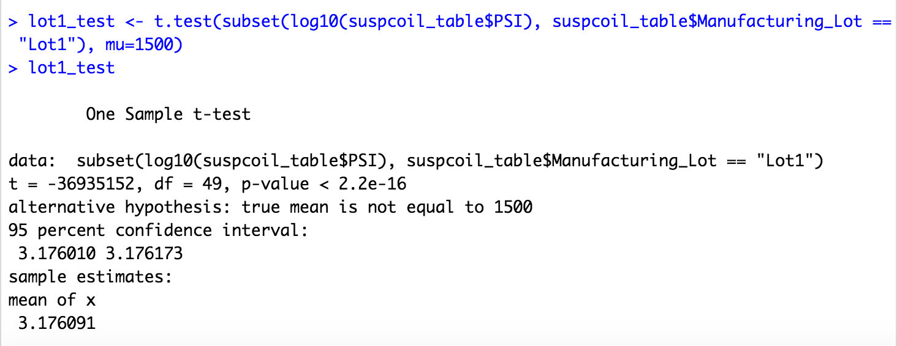

# Statistic and R 

## Overview of Project
The purpose of this project is to perform multiple linear regression analysis, collect summary statistic, run t-test and design a statistical study for a given dataset.

## Resources:
* Data sources: MechaCar_mpg.csv

## Tools:
* R
* RStudio

## Linear Regression to Predict MPG

## Summary Statistics on Suspension Coils

## T-Tests on Suspension Coils

## Study Design: MechaCar vs Competition

